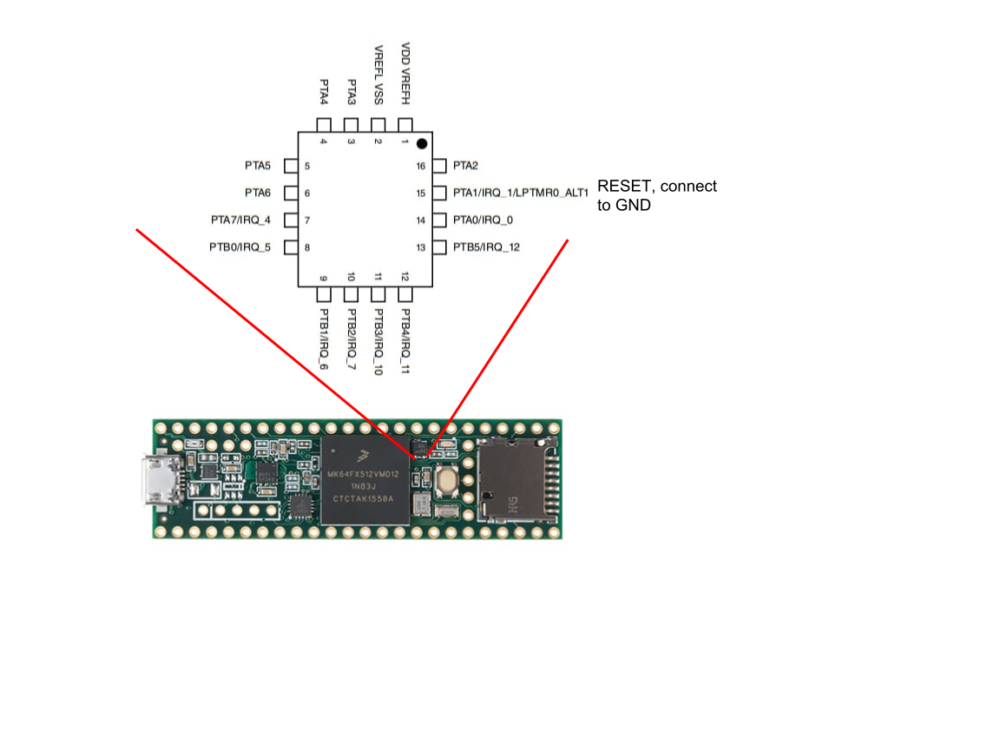

# Teensy 3.5 blinky + cmake + Black Magic Probe SWD debugger
MKL02 contains bootloader that is programmed to Teensy so it is possible to load new firmware via USB. 
There are accessible pins for SWD debugging with pin labeled as DE to temporary disable MKL02.
Unfortunately this functionality seems not to be implemented and SWD is not able to work correctly, because MKL02 keeps sending some data over SWD.
MKL02 has hardware reset pin *PTA1* that can be grounded to keep processor in reset and allow SWD debugging via external open source Black Magic Probe debugger.
Black Magic probe firwmare can also be flashed to cheap ST-Link sold on ebay.
You will need to connect another SWD debugger to its SWD pins and flash it.



You can build firmware with cmake:
```sh
$ mkdir build
$ cd build
$ make
```

Connect Black Magic Probe to the teensy and start gdb:
```sh
$ arm-none-eabi-gdb build/teensy_blink.elf -ex "target extended-remote /dev/ttyACM0" -ex "monitor swdp_scan" -ex "attach 1"
...
(gdb) load
Loading section .text, size 0x1cf8 lma 0x0
Loading section .init, size 0x4 lma 0x1cf8
Loading section .fini, size 0x4 lma 0x1cfc
Loading section .data, size 0x68 lma 0x1d00
Start address 0x250, load size 7528
Transfer rate: 8 KB/sec, 684 bytes/write.
(gdb) break main
Breakpoint 1 at 0xc2e: file source/led_blinky.c, line 77
(gdb) continue
Continuing.
Note: automatically using hardware breakpoints for read-only addresses.

Breakpoint 1, main () at source/led_blinky.c:77
```
